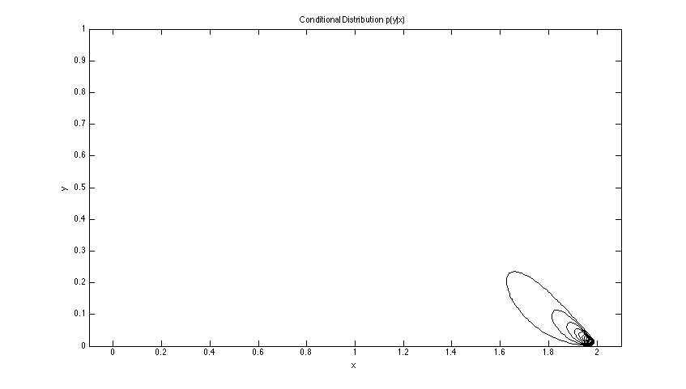
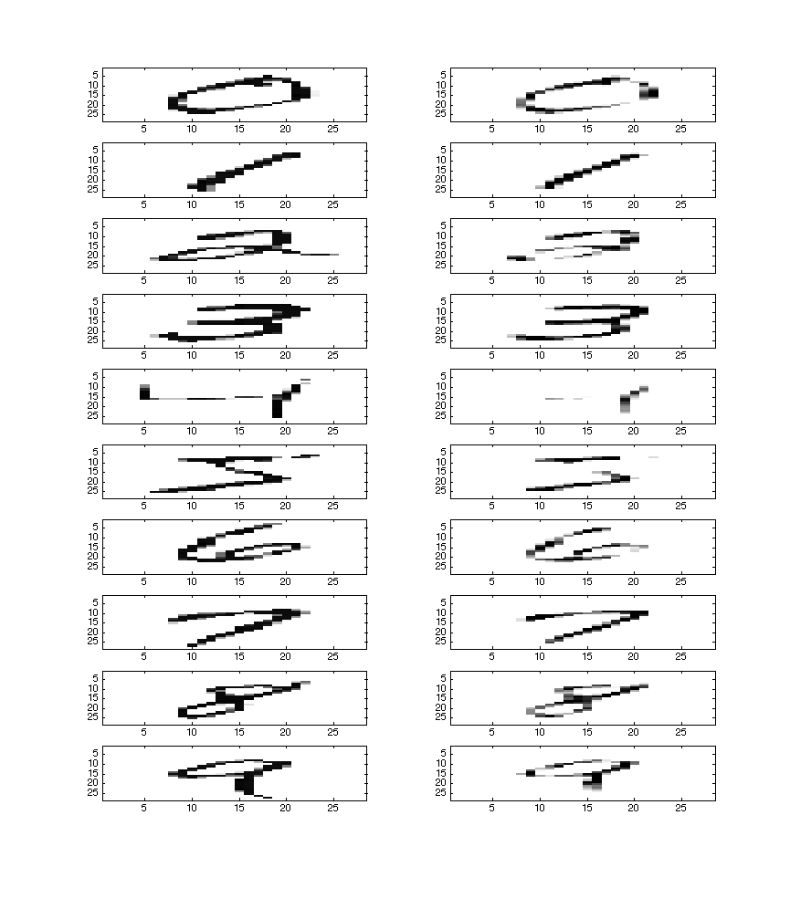

## Homework 1
\
Matt Dickenson \
CS 527 \
Fall 2014

### Problem 1


#### (a)

**integrate.m**:

```
function i = integrate(p, dx, dy)
  % Leaving both dx and dy unspecified should cause an error.
  if nargin < 2
    error('dx and/or dy must be specified')
  end
  

  if isvector(p)
    % approximate over p by dx
    if (nargin == 3 && ~isempty(dy))
      error('dy is specified but p is one-dimensional')
    end
    m = size(p);
    a = p(1);
    b = p(end);
    total = (a + b) + sum(p(2:end-1));
    i = dx * total;
    return
  else
    
  end
  
  % produces a column vector
  if ~isvector(p) && (nargin == 2 || isempty(dy))
    % todo: don't use an explicit loop
    [nrows, ncols] = size(p)
    cols = zeros(nrows, 1)
    for row=1:nrows
      cols(row, 1) = integrate(p(row, :), dx);
    end
%     cols = integrate(p(, :), repmat(dx, nrows, 1))
    i = cols
    return
  end
  
  % returns a row vector
  if isempty(dx) && ~isempty(dy)
    i = transpose(integrate(transpose(p), dy))
    return
  end
  
  % returns a scalar
  if nargin==3 % && size(size(p))==3
    % use Fubini's thm
    
    i = integrate( integrate(p, dx),  dy)
    return
  end

end
```

The marginal distribution $p(x)$, computed both analytically and numerically, is shown in Figure 1 below.


#### (b)

The root-mean-square discrepancy between the numerical and the analytical calcuations is 0.0078.


#### (c)

```
x = linspace(-0.1, 2.1, 201);
y = linspace(0, 1, 101);
P = pXYa(x, y)
dy = 0.01
pxn = integrate(P, [], dy)

[nrows, ncols] = size(P)
pygxn = P ./ (ones(nrows, 1) * pxn) 
pygxn(isnan(pygxn)) = 0
contour(x, y, pygxn, 20, 'Color', 'k')
```



#### (d)

Figure 2 above shows that $X$ and $Y$ are not independent because the probability of low values of $Y$ is highly concentrated on the area where $1.6 < X < 2$. If the two variables were independent, the contours in the $x$ direction would be horizontal lines, indicating that values of $x$ do not give us information about the probability of $y$ values.

#### (e)

To compute samples of a joint probability distribution $p^\prime (x, y)$ with the same marginals as above, I computed the marginals and multiplied them together. This is consistent with the independence assumption. The code snippet and contour plot are shown below.

```
pxn = integrate(pxya, [], dy)
pyn = integrate(pxya, dx)
pxy_indep = pyn * pxn

ppygx = pxy_indep ./ (ones(nrows, 1) * pxn)
ppygx(isnan(ppygx)) = 0
contour(x, y, ppygx, 20, 'Color', 'k')
xlabel('x')
ylabel('y')
title('Conditional Distribution p(y|x) When Independent')
```


#### (f)

If there are $m+1$ samples in each of $x$ and $y$, calculating the two-dimensional integral using Fubini's theorem and the trapezoidal rule takes $m^2$ sums.

#### (g)

In general, computing a $d$-dimensional integral using Fubini's theorem and the trapezoidal rule takes $m^d$ steps for $m+1$ samples.

#### (h)

Since the complexity is exponential, using Fubini's theorem and the trapezoidal rule to compute high-dimensional integrals is very time consuming. 

### Problem 2

#### (a)

The vectors in `cimg` are 12.25 ($28^2 \over 64$) times shorter than the original images strung into vectors.

#### (b)

A pair of images (original on the left, reconstructed on the right) is shown for each digit below.


